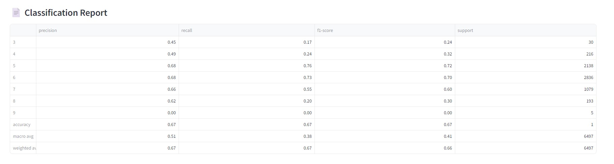

---

# 🍷 Wine Quality Prediction using K-Nearest Neighbors (KNN)

This end-to-end machine learning project predicts **wine quality scores** using the **K-Nearest Neighbors (KNN)** algorithm. It covers:

✅ Clean Data Preprocessing & Feature Scaling
✅ GridSearchCV-based Hyperparameter Tuning
✅ Evaluation Metrics + Confusion Matrix
✅ SHAP Explainability for Predictions
✅ Real-time Streamlit App Interface
✅ Docker & GitHub CI/CD Integration

---

## Project Structure

```
wine-quality-knn-project/
├── data/                    # Dataset CSV
├── models/                  # Saved KNN model
├── output/                  # Evaluation reports and confusion matrix image
├── scripts/                 # Modular ML scripts
│   ├── preprocess.py        # Data loading and scaling
│   ├── train.py             # Model training pipeline
│   ├── evaluate.py          # Model evaluation and reporting
├── streamlit_app/
│   └── app.py               # Streamlit interface
├── requirements.txt         # Python dependencies
├── Dockerfile               # Docker build file
├── docker-compose.yml       # Docker Compose config
├── .github/workflows/ci.yml# GitHub CI config
└── README.md                # Project overview and usage
```

---

## Setup Instructions

### 1. Clone the Repository

```bash
git clone https://github.com/amitkharche/Classification_Wine_Quality_KNN_Streamlit.git
cd Classification_Wine_Quality_KNN_Streamlit
```

### 2. Install Dependencies

```bash
pip install -r requirements.txt
```

### 3. Train the Model

```bash
# With GridSearchCV hyperparameter tuning
python scripts/train.py --use_grid_search

# Or with default K=5
python scripts/train.py
```

### 4. Evaluate the Model

```bash
python scripts/evaluate.py
```

### 5. Launch Streamlit App

```bash
streamlit run streamlit_app/app.py
```

---

## Streamlit App Features

### Predict Tab

* Responsive **3-column layout** for entering wine features
* Predicts wine `quality` score using the trained KNN model
* SHAP **waterfall plot** to explain individual prediction
* Compact SHAP visuals (6x4") with top 8 feature impacts

  
  


### Dashboard Tab

* **Confusion Matrix** heatmap with larger font for clarity
* **Classification Report** shown as a styled table
* Evaluates model performance across full dataset


  


---

## SHAP Explainability

* `shap.Explainer()` used with KNN model for interpretability
* Highlights which features most influenced the predicted score
* Waterfall plot helps understand individual predictions

---

## Docker Setup

### Manual Docker Build

```bash
docker build -t wine-knn-app .
docker run -p 8501:8501 wine-knn-app
```

### Docker Compose

```bash
docker-compose up --build
```

---

## CI/CD Pipeline (GitHub Actions)

Your CI pipeline can:

* Automatically retrain the model
* Generate evaluation metrics
* Be extended to include testing, linting, deployment

Located at:

```
.github/workflows/ci.yml
```

---

## Dataset Information

* **Source**: [UCI Wine Quality Dataset](https://archive.ics.uci.edu/ml/datasets/Wine+Quality)
* **Features**: acidity, chlorides, alcohol, pH, etc.
* **Target**: Wine `quality` (integer values)

---

## Future Enhancements

* [ ] Compare KNN with RandomForest, LightGBM, XGBoost
* [ ] Streamlit Cloud or HuggingFace Spaces deployment
* [ ] MLflow tracking integration
* [ ] Add LIME or SHAP bar visualizations
* [ ] REST API with FastAPI or Flask

---

## License

Licensed under the **MIT License**.
See [`LICENSE`](LICENSE) for full terms.

---

## Contributing

Contributions are welcome!
If you'd like to improve the project, feel free to:

* ⭐ Star the repo
* 🐞 Open issues for bugs or feature requests
* 📦 Submit pull requests for enhancements

---

## 📬 Contact

Have questions or want to collaborate? Connect with me:

* [LinkedIn](https://www.linkedin.com/in/amitkharche)
* [Medium](https://medium.com/@amitkharche)
* [GitHub](https://github.com/amitkharche)

---
